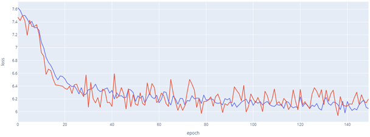
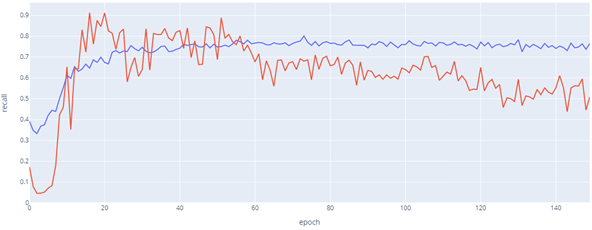
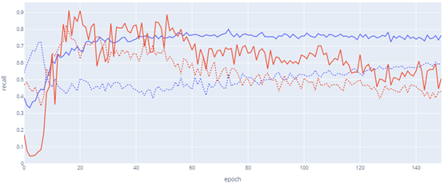

# Deep Learning model: LSTM based network
## README
Scripts for data preparation, network structure, training and evaluation can be found in `Model/`.
Main function can be seen in `Notebook_main.ipynb`, or `__main__.py`. A combination of modules in `Model/` and main function can be found in `Notebook_all.ipynb`.
## Best Performance of LSTM-based DL model
 

__Figure 1. Loss by epoch, for validation data (red) and training data (blue).__

   
  

 

__Figure 2. Model performance, measured in recall, by epoch, of malicious data (red) and clean data (blue).__

   
  

 

__Figure 3. Model performance on original data and shuffled data (dot line), measured in recall, by epoch, of malicious data (red) and clean data (blue).__

   

